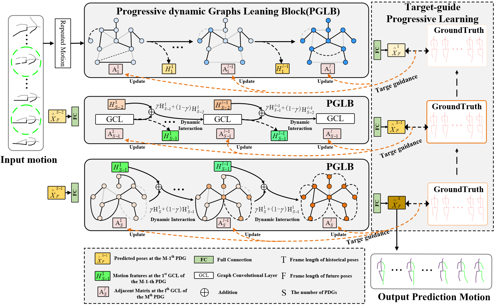

# TPDGN

**Tacking Over-smoothing: Target-guide Progressive Dynamic Graph Learning for 3D Skeleton-based Human Motion Prediction**

### Network Architecture
---



### Dependencies
---

- python 3.6
- cuda 10.2
- h5py==3.1.0
- matplotlib==3.3.4
- numpy==1.19.5
- pandas==1.1.5
- scipy==1.5.4
- six==1.16.0
- torch==1.8.1+cu102

### Data Preparation
---

Put the all downloaded datasets in ./data/ directory.

[Human3.6](http://vision.imar.ro/human3.6m/description.php) can be downloaded from [here](https://drive.google.com/file/d/15OAOUrva1S-C_BV8UgPORcwmWG2ul4Rk/view?usp=share_link). Please follow [the license of the dataset](http://vision.imar.ro/human3.6m/eula.php).

 ([Original stanford link](http://www.cs.stanford.edu/people/ashesh/h3.6m.zip) has crashed, this link is a backup from [siMLPe](https://github.com/dulucas/siMLPe)).

Directory structure:
```shell script
data
|-- h36m
|   |-- S1
|   |-- S5
|   |-- S6
|   |-- ...
|   |-- S11
```

[CMU mocap](http://mocap.cs.cmu.edu/) was obtained from the [repo](https://github.com/chaneyddtt/Convolutional-Sequence-to-Sequence-Model-for-Human-Dynamics) of ConvSeq2Seq paper.

Directory structure: 
```shell script
data
|-- cmu_mocap
|   |-- train
|   |-- test
```

[3DPW](https://virtualhumans.mpi-inf.mpg.de/3DPW/)

Directory structure: 
```shell script
data
|-- 3dpw
|   |-- sequenceFiles
|   |   |-- test
|   |   |-- train
|   |   |-- validation
```

### Training
---

#### H3.6M

```shell script
python main_h36m_3d.py --kernel_size 10 --dct_n 20 --input_n 50 --output_n 10 --skip_rate 1 --batch_size 32 --test_batch_size 32 --in_features 66 --n_layer 2 --num_stage 12 --drop_out 0.2 --alpha 0.2 --lamda 1.0
```

#### CMU mocap

```shell script
python main_cmu_3d.py --kernel_size 10 --dct_n 20 --input_n 50 --output_n 10 --skip_rate 1 --batch_size 32 --test_batch_size 32 --in_features 75 --n_layer 2 --num_stage 10 --drop_out 0.2 --alpha 0.4 --lamda 1.0
```

#### 3DPW

```shell script
python main_3dpw_3d.py --kernel_size 10 --dct_n 20 --input_n 50 --output_n 10 --skip_rate 1 --batch_size 32 --test_batch_size 32 --in_features 69 --n_layer 2 --num_stage 8 --drop_out 0.5 --alpha 0.2 --lamda 1.0
```

### Testing
---

#### H3.6M

```shell script
python main_h36m_3d_eval.py --kernel_size 10 --dct_n 20 --input_n 50 --output_n 25 --skip_rate 1 --batch_size 32 --test_batch_size 32 --in_features 66 --num_stage 12 --n_layer 2 --lamda 1 --alpha 0.2 --drop_out 0.2 --is_eval --ckpt ./checkpoint/main_h36m_3d_in50_out10_ks10_st12_layer2_a0.2_b1.0/
```

#### CMU mocap

```shell script
python main_cmu_3d_eval.py --kernel_size 10 --dct_n 20 --input_n 50 --output_n 25 --skip_rate 1 --batch_size 32 --test_batch_size 32 --in_features 75 --num_stage 10 --n_layer 2 --lamda 1 --alpha 0.4 --drop_out 0.2 --is_eval --ckpt ./checkpoint/main_cmu_3d_in50_out10_ks10_st10_layer2_a0.4_b1.0/
```

#### 3DPW

```shell script
python main_3dpw_3d_eval.py --kernel_size 10 --dct_n 20 --input_n 50 --output_n 30 --skip_rate 1 --batch_size 32 --test_batch_size 32 --in_features 69 --num_stage 8 --n_layer 2 --lamda 1 --alpha 0.2 --drop_out 0.5 --is_eval --ckpt ./checkpoint/main_3dpw_3d_in50_out10_ks10_st8_layer2_a0.2_b1.0/
```

### Acknowledgments
---

The overall code framework (dataloading, training, testing etc.) is adapted from [HisRepItself](https://github.com/wei-mao-2019/HisRepItself)
